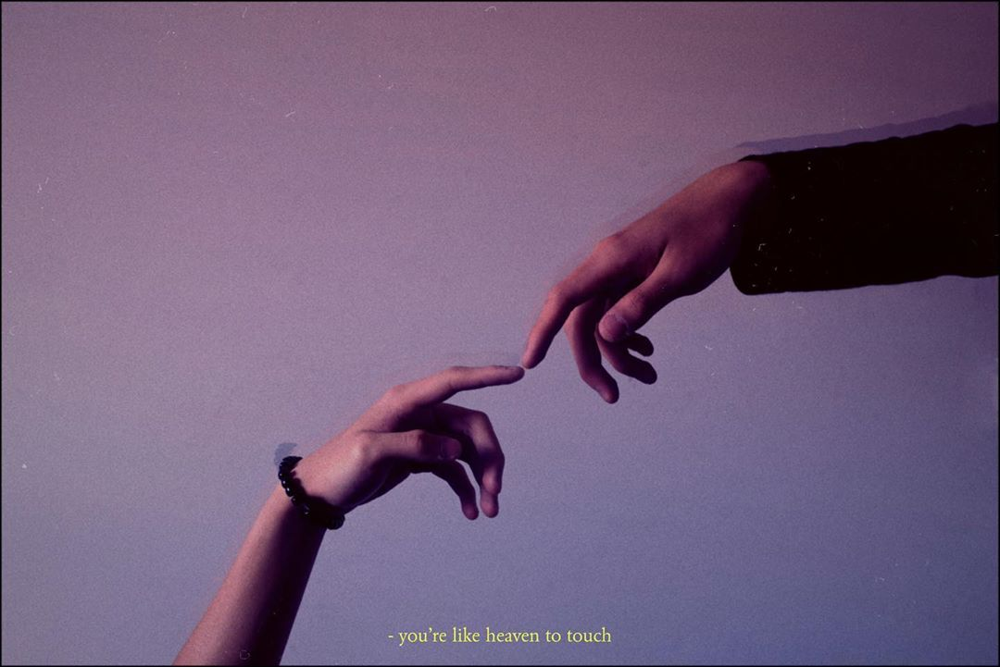

You can see that I sometimes added a yellow subtitle into my photos. But what's the actual styles behind it? This post will talk just about that.

##The tools

I recommend Photoshop since that's my go-to professional editing software out there. But feel free to use your favourite!

##The styles

- **Font** - EB Garamond</u>
- **Colour** - #D0DC8F or similar shades

## The Convention

- Centred text position
- Small text sizes
- Starts with "-"