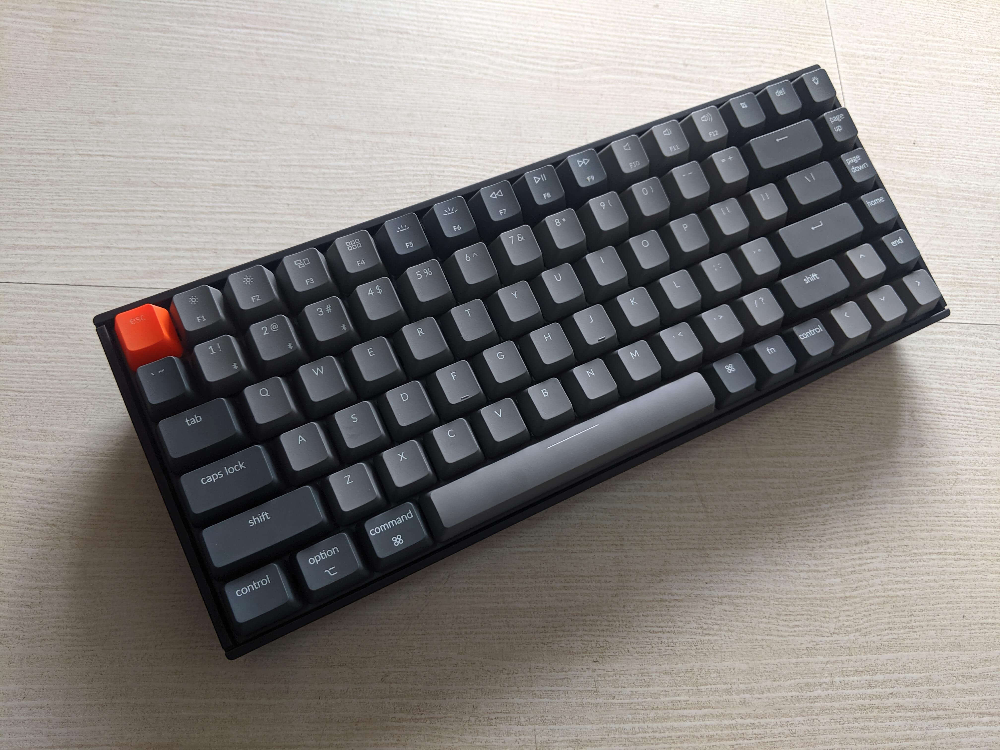
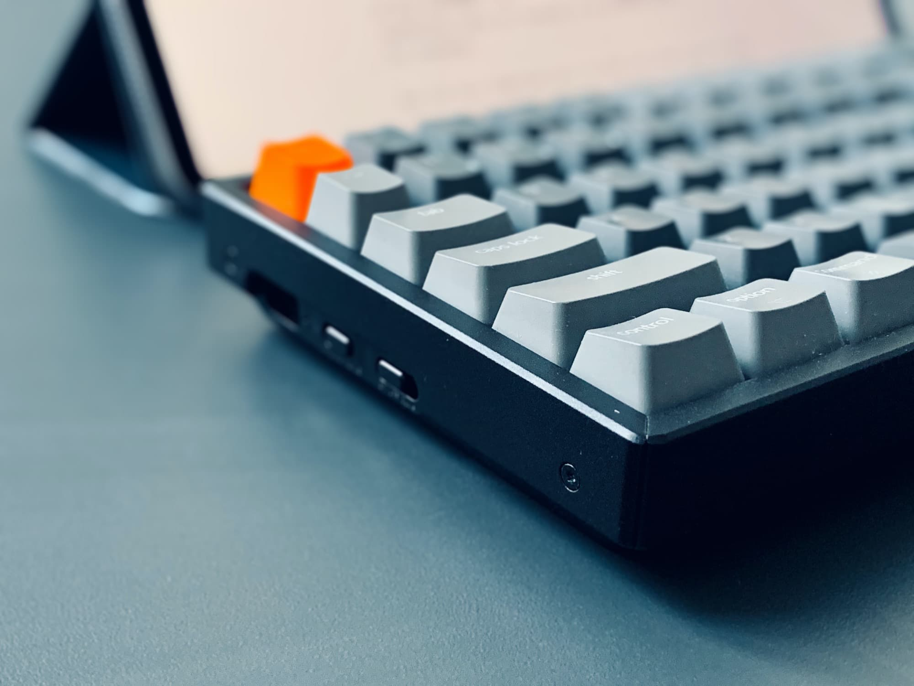
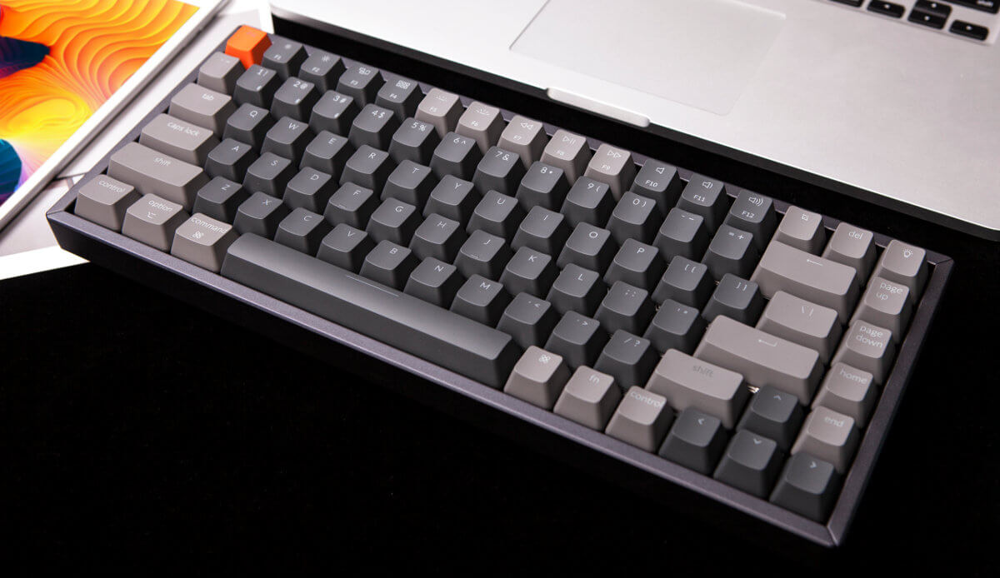

A couple of days ago, I invested myself in a mechanical keyboard. I was on the market hunting for a good keyboard as typing is a great part of both my study and work.

I came across Keychron and their product proofs to be very reliable from the given budget - a *catch!*

Not only it's aesthetically pleasing, but it is very compact, has a great battery life, and a very soothing clicky sound!

## The product
[Here](https://www.keychron.com/products/keychron-k2-wireless-mechanical-keyboard) is the product page for the keyboard that I got. It's a K2 version with a brown switch. Not too clicky, and not too quiet. Just perfect.

## What I like
The product has an RGB light, which also adds to the aesthetic. Also has the option to switch between Mac OS and windows, so a good for both world! It also has wired and wireless feature!

There are several lights feature that you can change - so play around with it to find your liking!

## Final touch

It suits perfect with my desktop setup, doesn't look off, and most important thing is, *great clicking sound!*

## Footnote
Images are not mine - I'm not sharing my setup here since there are a couple of personal writings and research that will take time to remove for the sake of photo - so here's this for now (: